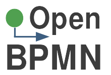
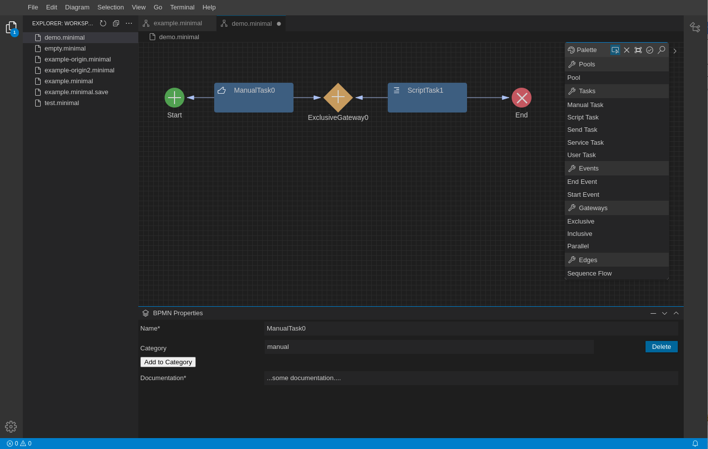

**Open BPMN** is a free BPMN 2.0 modeling platform that can be extended and customized by any BPMN 2.0 compliant execution engine.
Open BPMN is based on the [Eclipse Graphical Language Server Platform (GLSP)](https://www.eclipse.org/glsp/) providing an open-source framework for building diagram editors based on modern web technologies.

The primary goal of this project is to provide a graphical BPMN editing framework that can be extended in various ways by different solutions to create an agile and innovative  community around the BPMN standard. 

<h2 align="center"><a href="https://open-bpmn.imixs.org" target="_blank">Start the Online Demo</a></h2>

**Please Note:** The project is still under development and we invite you to join this project. See the developer details below. 

## What is BPMN 2.0?

The [Business Process Model and Notation](https://www.omg.org/spec/BPMN/) (BPMN 2.0) is an open standard to describe business processes that can be visualized in diagram editors and executed by process engines compliant with the BPMN 2.0 standard. This makes BPMN an interoperable, interchangeable and open standard in the field of business process management.

BPMN was intended for users at all levels, from the business analysts who create the initial design, to the developers who implement the technical details, and finally, to the business users responsible for managing and monitoring the processes. 

As a XML language proposed by the [Object Management Group](https://www.omg.org/spec/BPMN/) (OMG), BPMN
is not only  a notation for describing  business workflows but also higher-level collaborations between business partners and the choreography of information flows between applications, microservices and cloud platforms. 

## Extensibility 

BPMN 2.0 introduces an extensibility mechanism that allows extending standard BPMN elements with additional properties and behavior. It can be used by modeling tools to add non-standard elements or Artifacts to satisfy a specific need, such as the unique requirements of a vertical domain, and still have a valid BPMN Core.

One goal of *Open BPMN* is to not only provide a graphical modeling tool, but also to allow developers and independent projects to easily customize the behavior and appearance of the editor for specific BPM workflow engines that use this BPMN 2.0 extensibility mechanism.

Open Source Workflow Engines like [Imixs-Workflow](https://www.imixs.org) integrate Open BPMN into there tooling platforms and extend the core features of BPMN 2.0 with platform specific functionality. 

[Learn more about Open BPMN Extensions.](./doc/BPMN_EXTENSIONS.md)

## Architecture

Open BPMN is based on the [Eclipse Graphical Language Server Platform (GLSP)](https://www.eclipse.org/glsp/) and provides the following building blocks:

 - [open-bpmn.metamodel](./open-bpmn.metamodel/README.md) - an open BPMN 2.0 metamodel
 - [open-bpmn.glsp-server](./open-bpmn.glsp-server/README.md) - the GLSP Server implementation
 - [open-bpmn.glsp-client](./open-bpmn.glsp-client/README.md) - the GLSP Client components and Theia integration

### Open-BPMN - BPMN 2.0 Metamodel

OpenBPMN provides a BPMN 2.0 Metamodel based on pure java. This library can be used to generate a BPMN model programmatically as also import or export a model form any .bpmn file. So in case you want to implement you own BPMN workflow engine the OpenBPMN Metamodel is the perfect library to work with BPMN 2.0 files. THe OpenBPMN Metamodel is based o the `org.w3c.dom` XML API and includes a set of junit test classes which may be helpful to implement you own business logic. 

 - [OpenBPMN Metamodel](./open-bpmn.metamodel/README.md)

### Open-BPMN GLSP-Server

The [open-bpmn.glsp-server](./open-bpmn.glsp-server/README.md) provides the GLSP Server part. The server part is responsible to load and store the diagram from a .bpmn file.

### Open-BPMN GLSP-Client

The [open-bpmn.glsp-client](./open-bpmn.glsp-client/README.md) is the GLSP Client part of Open BPMN providing the graphical modeling tool. 

# Build and Run

To build the complete project run 

	$ ./build.sh

This will build the server module with maven and the client modules with yarn. The script finally automatically starts the application.

The Application can be started from a Web Browser

	http://localhost:3000/

	

## Locally build for Development

During development you can run the frontend and backend in separate tasks. This gives you more control over the CLient and the Backend Component. 

To build & start the GLSP Server only, run:

	$ ./build.sh -b

To build & start the GLSP Client only, run:

	$ ./build.sh -f

To start the GLSP Client without building, run:

	$ ./build.sh -s
	
For a full clean & reinstall of the GLSP Client (after upgrades), run:

	$ ./build.sh -c -i

You will find more details in the [Client Section](./open-bpmn.glsp-client/README.md) and the [Server Section](./open-bpmn.glsp-server/README.md).

## Development

Open BPMN is based on [Eclipse GLSP](https://www.eclipse.org/glsp/) and adapts the different concepts in various ways. The following sections provide details about the development with Eclipse GLSP and the solutions used in Open BPMN.

 - [Build your Own EMF Model](./doc/BPMN_EMF.md)
 - [Tool Palette](./doc/TOOL_PALETTE.md)
 - [Custom Element Views](./doc/CUSTOM_VIEWS.md)
 - [Ports](./doc/PORTS.md)
 
 
 
### NodeJS

We use nodejs on Linux Debian during development. To manage version of nodejs in debian see: https://phoenixnap.com/kb/update-node-js-version

For development with Eclipse Theia the expected version is ">=10.11.0 <17". For that reason we tested with following version  16.11.0. You can list all current versions [here](https://nodejs.org/en/download/releases/). 

In case you have install npm you can install a specific nodejs version with:

	$ sudo n 16.11.0
 
 
To install typescript run:

	$ sudo npm install -g typescript 
	