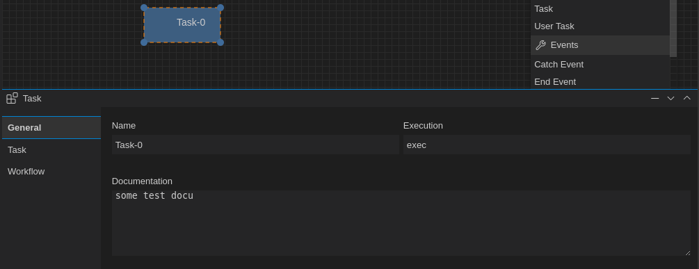

# The BPMN Properties Panel

Open-BPMN provides a property panel within the diagram plane to be used to edit and update BPMN Element properties.

## JSONForms

The `bpmn-property-panel.tsx` is implementing a `SelectionListener` to display the properties of a selected BPMN element.
The input form which contains the different input elements is based on [JsonForms](https://jsonforms.io/). JsonForms expects three JSON schemata to describe the data elements and types:

 * data - holds the values of the data items
 * schema - describes the type of the data items
 * uischema - contains layout information
 
The schemata is generated server side by the corresponding BPMN Extension by implementing the method `buildPropertiesForm`

	@Override
	public void buildPropertiesForm(final BPMNBaseElement bpmnElement, final DataBuilder dataBuilder,
            final SchemaBuilder schemaBuilder, final UISchemaBuilder uiSchemaBuilder) {
            ....
	}

	
	
### Custom Renderer

Most of the data to be displyed can be handled by JsonForms out of the box, so we only need to provide the corresponding schemata. But in some cases - e.g. the BPMN Event definitions - the corresponding input form is more complex. For this we implement a [custom renderer](https://jsonforms.io/docs/tutorial/custom-renderers) to provide an optimized input form. 

The custom renderer for Event definitions splits into tree parts:

 * EventDefinitionForm - shows the HTML part implemented in React
 * EventDefinitionControl - the JsonForms Control element
 * EventDefinitionTester - the tester class deciding if the control should be used. 