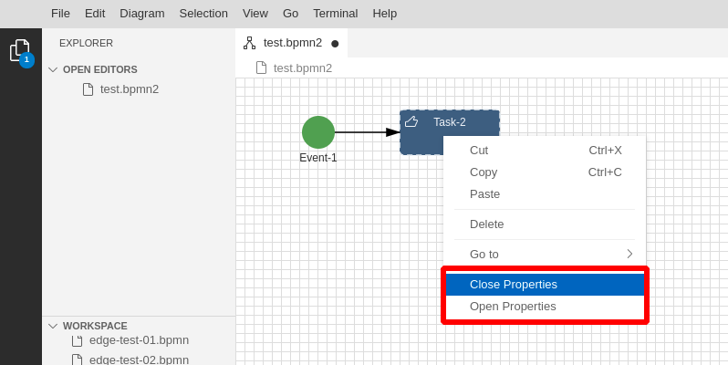
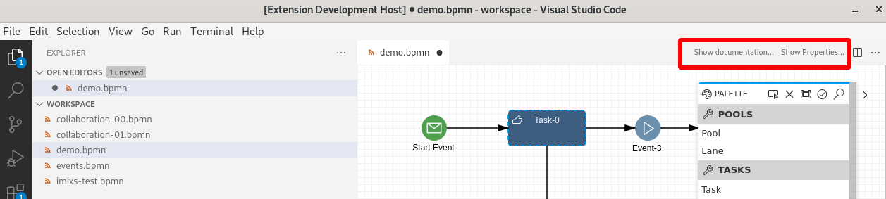

# How to configure Context Menus

Context menus in GLSP are menu actions triggered in the conext of a selected element or a the diagram plane. Conext menues are tightly coupled to the execution platform. For example in Theia the context menu is shown by a right-mouse-click on the diagram plane.



 In Visual-Code the same menu action is handled as a so called sub-menu which appears on the top bar of the diagram.  
 

 
For this reason the implementation is different for both platforms.
To add custom menu elements in the diagram context menu the following parts need to be implemented

## Context Menu in Theia Module

To add a new context menu entry in the Theia platform you first need to implement a command and menu contribution class. This can be done in a separate module. This module is exporting two classes:

- a `CommandContribution` defining a command action to be send
- a `MenuContribution` defining the context menu entries

In the `CommandContribution` it is also possible to define in which situation the context mene should be enabled or disabled. For example you can verify if an element is selected or not:

```javascript
        commands.registerCommand(
            { id: PropertyPanelCommands.PROPERTIES_OPEN, label: 'Open Properties' },
            new GLSPCommandHandler(this.shell, {
                actions: () => [NavigateAction.create('properties')],
                isEnabled: context => context.selectedElements.length === 1
            })
        );
```

Next the contributions need to be bound in `TheiaFrontendModule` of the webview. This can be done by overwriting the `configure(context)` method. Here is an example:

```javascript
     override configure(context: ContainerContext): void {
        // Custom workflow commands and menus
        context.bind(CommandContribution).to(BPMNPropertiesCommandContribution);
        context.bind(MenuContribution).to(BPMNPropertiesMenuContribution);

    }
```

Now whenever the user opens the context menu in the diagram plane the new entry will appear and fires the corresponding command. 

## Context Menu in Visual Code

In Visual Code no context menu exits but the so called sub menu which appears on top of the diagram plane. 

To add a new command contribution to a VisualCode extension the commands can be registered within the `activate` function of the extension module:

```javascript
....
  configureDefaultCommands({
    extensionContext: context,
    connector: glspVscodeConnector,
    diagramPrefix: "bpmn",
  });

  context.subscriptions.push(
    vscode.commands.registerCommand("bpmn.showProperties", () => {
      console.log("send show properties...");
      glspVscodeConnector.sendActionToActiveClient(
        NavigateAction.create("properties")
      );
    }),
    vscode.commands.registerCommand("bpmn.showDocumentation", () => {
      console.log("send show documentation...");
      glspVscodeConnector.sendActionToActiveClient(
        NavigateAction.create("documentation")
      );
    })
  );
...
```
Also here the command is responsible for sending the corresponding action event. 

Next you can register the sub menu entries in the extension configuration in the file `package.json` within the `contributes` section:

```
....
  "contributes": {
    ....
    "commands": [
      {
        "command": "bpmn.showProperties",
        "title": "Show Properties...",
        "category": "BPMN Diagram",
        "enablement": "activeCustomEditorId == 'bpmn-diagram' && bpmn.editorSelectedElementsAmount == 1"
      },
      {
        "command": "bpmn.closeProperties",
        "title": "Close Properties...",
        "category": "BPMN Diagram",
        "enablement": "activeCustomEditorId == 'bpmn-diagram' && bpmn.editorSelectedElementsAmount == 1"
      }
    ],
    "submenus": [
      {
        "id": "bpmn.editor.title",
        "label": "Diagram"
      }
    ],
    "menus": {
      "editor/title": [
        {
          "submenu": "bpmn.editor.title",
          "group": "bookmarks"
        },
        {
          "command": "bpmn.showProperties",
          "group": "navigation",
          "when": "activeCustomEditorId == 'bpmn-diagram' && bpmn.editorSelectedElementsAmount == 1"
        },
        {
          "command": "bpmn.closeProperties",
          "group": "navigation",
          "when": "activeCustomEditorId == 'bpmn-diagram' && bpmn.editorSelectedElementsAmount == 1"
        }
      ],
....
```


## Server Side

An action triggered by the Context menu can optional trigger a `RequestNavigationTargetsAction` (see NavigationActionHandler) in order to request the navigation targets from the server.

```java
public class PropertiesNavigationTargetProvider implements NavigationTargetProvider {

   @Override
   public String getTargetTypeId() {
      return "properties";
   }
   @Override
   public List<? extends NavigationTarget> getTargets(final EditorContext editorContext) {
      // your code goes here...
      return Arrays.asList();
   }
}
```

In your DiagramModule you need to bind your Provider class

```java
....
    @Override
    protected void configureNavigationTargetProviders(final MultiBinding<NavigationTargetProvider> binding) {
        super.configureNavigationTargetProviders(binding);
        binding.add(PropertiesNavigationTargetProvider.class);
    }
    ...
```