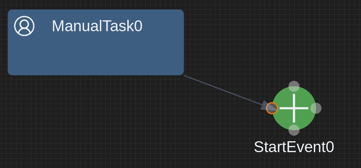

# Ports

Ports in GLSP are a way to describe docking points for a graphical node element to connect edges. Ports are a concept of [Eclipse Sprotty](https://github.com/eclipse/sprotty) and are adapted by GLSP. Ports are optional. This means that if you do not define explicit ports you can connect an edge on any border of your graphical element.


If you have more complex model elements ports are a good solution to define where edges can be placed to connect your nodes.


If you define ports, edges can only be placed on specific docking positions within your node element. This gives you more control about the design and layout of your diagrams.



## How to Define Ports

Ports are part of your model. This means first of all you have to define ports along with your node builder class

### GLSP Server

```java
public class EventNodeBuilder extends AbstractGNodeBuilder<EventNode, EventNodeBuilder> {

	....

   @Override
   public void setProperties(final EventNode node) {
      super.setProperties(node);
      .....
      node.getChildren().add(createPort(node, -5.0, -25.0, "_north"));
      node.getChildren().add(createPort(node, -25.0, -5.0, "_west"));
      node.getChildren().add(createPort(node, 15.0, -5.0, "_east"));
      node.getChildren().add(createPort(node, -5.0, 15.0, "_south"));
   }

   private GPort createPort(final EventNode node, final Double x, final Double y, final String subID) {
      return new GPortBuilder()
         .id(node.getId() + subID)
         .position(x, y)
         .size(5.0, 5.0)
         .build();
   }
}
```


Next you need to extend your DiagramConfiguration by providing the EdgeHints:

```java
public class BPMNDiagramConfiguration extends BaseDiagramConfiguration {

   ....
DefaultTypes.PORT
   /**
    * Returns the edge type hints for the diagram implementation. Edge type hints are sent to the client and used to
    * validate whether certain operations for edges are allowed without having to query the server again.
    *
    * @return List of all edge type hints for the diagram implementation.
    */
   @Override
   public List<EdgeTypeHint> getEdgeTypeHints() {
      List<EdgeTypeHint> edgeHints = new ArrayList<>();
      edgeHints.add(createDefaultEdgeTypeHint(EDGE));
      EdgeTypeHint sequenceFlowHint = createDefaultEdgeTypeHint(ModelTypes.SEQUENCE_FLOW);
      edgeHints.add(sequenceFlowHint);
      return edgeHints;
   }

   @Override
   public EdgeTypeHint createDefaultEdgeTypeHint(final String elementId) {
      EdgeTypeHint hint = super.createDefaultEdgeTypeHint(elementId);
      // allow tasks and ports
      hint.setSourceElementTypeIds(Arrays.asList(DefaultTypes.PORT,ModelTypes.MANUAL_TASK));
      hint.setTargetElementTypeIds(Arrays.asList(DefaultTypes.PORT,ModelTypes.MANUAL_TASK));
      return hint;
   }

	....

}
```

### GLSP Client 

Now you server model provides additional port information to the client. To render the ports on you client, you have to provide the port element within your diagram configuration:


```javascript
const bpmnDiagramModule = new ContainerModule((bind, unbind, isBound, rebind) => {
  
    .....
    configureModelElement(context, 'port', RectangularPort, RectangularNodeView);
    ......
});
```

In case you have defined custom views you need to ensure that your ports are rendered by calling the `renderChildren` method. 

```javascript
@injectable()
export class EventNodeView extends ShapeView {
	render(element: EventNode, context: RenderingContext): VNode | undefined {

	....
	
			vnode = (
				<g transform={'scale(1) translate(0,0)'} class-sprotty-node={true}>
					<circle r="20" cx="0" cy="0" ></circle>
					<g class-icon={true}>
						<path transform={'scale(2.0) translate(-7.5,-7.5)'}
							d={eventSymbol} />
					</g>
					{context.renderChildren(element)}
				</g>
			);
	....
}
```


### Layout

The ports can be designed in various ways by just providing CSS definitions. See the following example which highlights the ports only if a edge modification is recognized:

```css
.sprotty-node .sprotty-port {
	stroke-width: 1;
	stroke: transparent;
	fill: transparent;
}
.sprotty-graph.edge-modification-not-allowed-mode .sprotty-node:hover .sprotty-port,
.sprotty-graph.edge-creation-select-target-mode .sprotty-node:hover .sprotty-port,
.sprotty-graph.edge-reconnect-select-target-mode .sprotty-node:hover .sprotty-port {
	fill: #d4d4d478;	
}
.sprotty-graph.edge-creation-select-target-mode .sprotty-node .sprotty-port.mouseover,
.sprotty-graph.edge-reconnect-select-target-mode .sprotty-node .sprotty-port.mouseover {
	fill: rgb(85, 87, 83);
	stroke: #f57900;
} 
```
