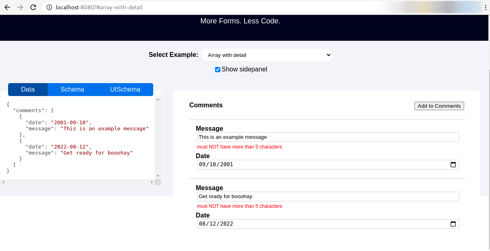

# Open-BPMN - Properties

Open-BPMN-Properties is a Node.js library and part of the [Open-BPMN](https://www.open-bpmn.org/) project. The module `@open-bpmn/open-bpmn-properties` is a  GLSP UI extension providing an additional property panel showing element properties. 
The Open-BPMN Properties are part of the Open-BPMN extensibility mechanism and provides a convinience way to edit BPMN properties of selected elements within a diagram. The panel is realized as a embedded view and can be used with all Integration platforms supported by Eclipse GLSP. 

## Build and Dependencies

To build the client module run

	$ yarn

The module open-bpmn-properties automatically integrates into the GLSP Client part. It is included as a independent module directyl into the GLSPDiagramContainer function:

	
	import {bpmnPropertyModule} from '@open-bpmn/open-bpmn-properties';
	
	const bpmnDiagramModule = new ContainerModule((bind, unbind, isBound, rebind) => {
	   .....
	});
	
	export default function createBPMNDiagramContainer(widgetId: string): Container {
	    // Create the createClientContainer with the diagramModule and the BPMN bpmnPropertyModule...
	    const container = createClientContainer(bpmnDiagramModule, bpmnPropertyModule);
	    overrideViewerOptions(container, {
	        baseDiv: widgetId,
	        hiddenDiv: widgetId + '_hidden'
	    });
	    return container;
}

## Integration

The content displayed in the property panel is generated on the server side. So usually it is not necessary to extend or customize this module. See the Open-BPMN Extension mechanism for more details. 

## JsonForms

The module open-bpmn-properties  is based on [JsonForms component](https://github.com/eclipsesource/jsonforms) to render the property panel of a selected BPMN element. JsonForms provides different `renderes` to display form elements like Input fields and buttons in a common layout. This module uses the 'VanillaRenderer' to display the property form elements.

JsonForms provides a powerful extensibility mechanism and alows to implement custom UI controls. If you want to contribute to this project or implement a new renderer components, it is recommended to first create a fork of the JsonForms project so you can later start pull a request to contribute your code.

For a first time setup:

* Install [node.js](https://nodejs.org/) (only Node 14 and npm 6 is currently supported)
* Fork this repository on Github 
* Clone this repository

Now you can start building the project and run the examples. First of all you need to install the base dependencies, then run lerna and then build all packages. After that you can execute the example application.

So starting from the root directory:

	# reset and clean everything
	git clean -dfx

	# build JSON Forms
	npm ci
	npm run init
	npm run build

	# e.g. Start React Vanilla example application
	cd packages/vanilla && npm run dev 

Run the example from your web browser: http://localhost:8080/#array-with-detail

