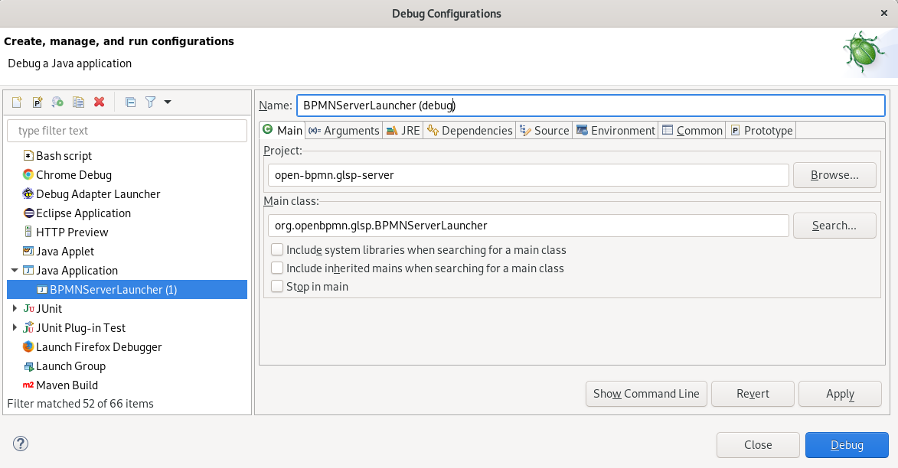

# Open BPMN - Server

This is the Imixs BPMN GLSP Server module used by the Imixs BPMN Client modules. 

## Building the Open BPMN server

To build the server part of Open BPMN run the maven command:

	$ mvn clean install

This will automatically launch the default profile 'fatjar'. This maven profile  will generate a sever jar including your EMF model and all necessary components. This is called a 'fatjar'. 

From the /target/ folder you can now start the server by executing the following commands (whereas X.X.X is the current version):

	$ cd target
	$ java -jar open-bpmn.server-[VERSION]-SNAPSHOT-glsp.jar org.imixs.bpmn.glsp.server.launch.BPMN2ServerLauncher

For VSCode there is a corresponding launch configuration available.

### Failed to send notification message.

In case you see server exceptions like this one:

```
WARNUNG: Failed to send notification message.
java.lang.reflect.InaccessibleObjectException: Unable to make private java.util.Collections$EmptyMap() accessible: module java.base does not "opens java.util" to unnamed module @23fe1d71
	at java.base/java.lang.reflect.AccessibleObject.checkCanSetAccessible(AccessibleObject.java:354)
```

it indicates a problem with the JVM / Gson Libraries. Find details [here](https://github.com/eclipse-glsp/glsp/discussions/702)

A possible solution is to add the VM Option `java.base/java.util=ALL-UNNAMED`. For VSCode this can be done by adding the following vmArgs to the launch config:

```
"vmArgs": [
    "--add-opens",
    "java.base/java.util=ALL-UNNAMED",
],
```

## Build & Run

During development you can use the 'build' script to build & run the backend in a separat task. This gives you more control as the server can be rebuild and started independent from your Client components. 

To build and start the GLSP Server only, run:

	$ ./build.sh -b

### Logging

You can extend the log file output by setting the optional logLevel to DEBUG

	java -jar open-bpmn.server-0.5.0-SNAPSHOT-glsp.jar org.openbpmn.glsp.BPMNServerLauncher -logLevel=DEBUG
	
	
### Debug - Eclipse

You can also launch the server from Eclipse IDE in the Debug mode. 	

Just start the `org.openbpmn.glsp.BPMNServerLauncher` application in Debug mode (Debug As - Java Application"

