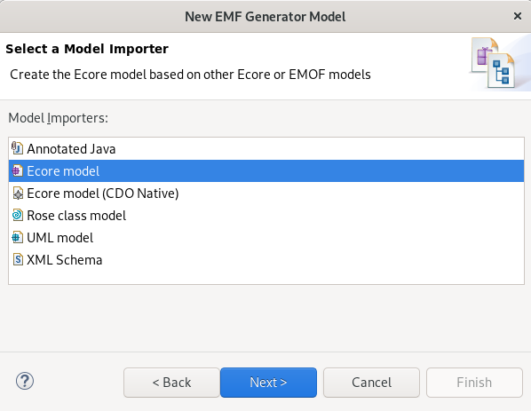
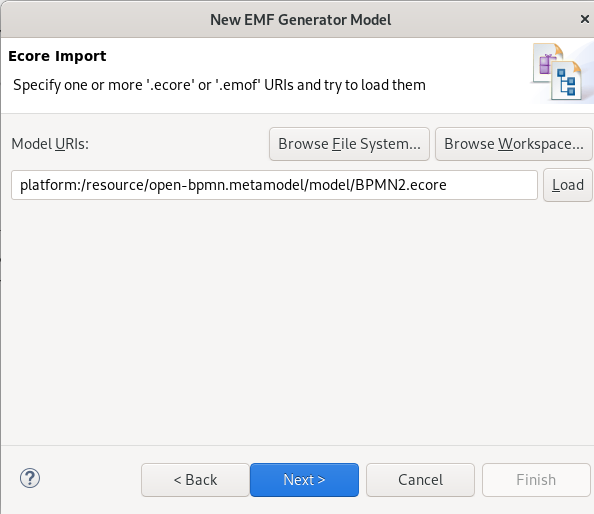
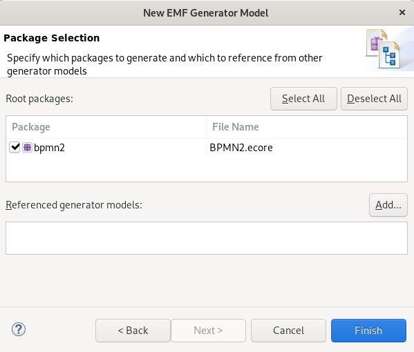
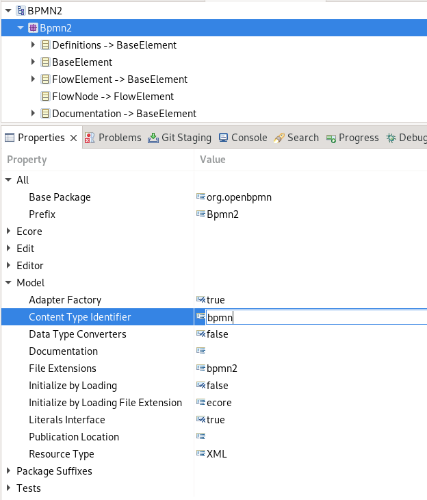

# Open BPMN 2.0 - Metamodel


OpenBPMN provides a Java Metamodel which can be used to create, load and manipulate a BPMN model programmatically. The Metamodel provides factory and model classes to work with an BPMN model instance. The libray is based on the `org.w3c.dom` XML API that allows you to handle any kind of BPMN model and also work with BPMN 2.0 extensions or add your own extensions. 

## The BPMNModelFactory

The class `BPMNModelFactory` provides methods to create an empty model or to load an existing one. The `BPMNModelFactory` returns a BPMNModel instance which can be used to read, update or delete elements.

### Load a Model

To load a model instance and add a new Process into the model you just need this:

```java
	// load model
	BPMNModel model = BPMNModelFactory.read("/process_1-empty-1.bpmn");
	// add a new process....
	model.addProcess("P-000002");
	// store the model
	model.save("src/test/resources/process_1-update-1.bpmn");
```


# Deprecated


This project provides the [BPMN 2.0 metamodel](https://www.omg.org/spec/BPMN/) based on the Eclipse Modeling Framework (EMF). Reed the full spcification [here](BPMN-2.0_formal-13-12-09.pdf).

See also:

 - https://archive.sap.com/kmuuid2/a0ec6d13-1ab4-2d10-dc87-c0a18d7f23c8/Making%20of%20the%20BPMN%202.0%20Metamodel%20for%20Eclipse%20Merge%20and%20Conquer
 - https://protutz.com/2020/01/17/emf-create-ecore-model-from-xsd-file/
 - https://protutz.com/2020/01/28/emf-update-the-ecore-model-and-generate-java-classes/
 
 

 
# Development

The following section provides a development guideline how to maintain the BPMN2.ecore file and generate the EMF class files using the BPMN2.genmodel.

## Create the BPMN.genmodel

You can recreate the BPMN2.genmodel file at any time. First delete the existing one. Next choose from the Eclipse IDE context menu of the `BPMN2.ecore`  file:

 *‘New->Other->EMF Generator Model’*

to create a new file `BPMN2.genmodel`.



Choose the importer ‘ecoremodel’ and click on next.



Next click on the load button, which will verify the EMF model file created before. Click on Next.




Finally select the package 'bpmn' and click on 'Finish' to generate the *.genmodel* file.

### Customize the .genmodel settings.

After the first generation of the .genmodel you need to change some global settings in the file.
 Open the *.genfile* and choose the 'Bpmn2' element of the graph and change the property  'Base Package' `org.openbpmn`. 
In the section 'Model' change the resource type to  "XML" and the contentTypeIdentifier to "bpmn"




Finally change the `modelDirectory` into "/open-bpmn.metamodel/src/main/java"  

Now you can click on the root element of the genfile and choose ‘Generate Model Code’. This will create the class files in the predefined package. 


## Updateing the EMF Classes

Once you do a change in the Ecore model, that change will be reflected automatically to the .genmodel as well. So in case you change the ecore model you just need to re-generate the model code once more, which will update existing class files. 


