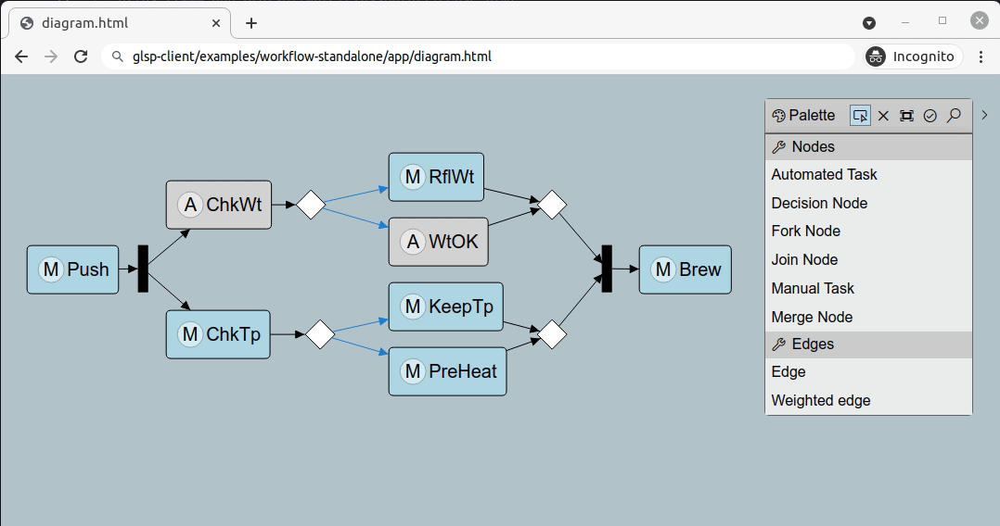

# glsp-workflow-example-client

This module contains the client implementation of the glsp-workflow-example. The client implementation is based on the [Eclipse gls-client project](https://github.com/eclipse-glsp/glsp-client). The example implementation can be used for different target platforms (HTML5, Eclipse Theia, VSCode, Eclipse RCP).

## Build

build the glsp-client packages:

	$ yarn install

## Run

Next you need to start your [glsp sever](../glsp-workflow-example-server/README.md) on port 8081. 
	
Once the server is running on port 8081, open the glsp-client/workflow-standalone/app/diagram.html file in your favorite browser.	

